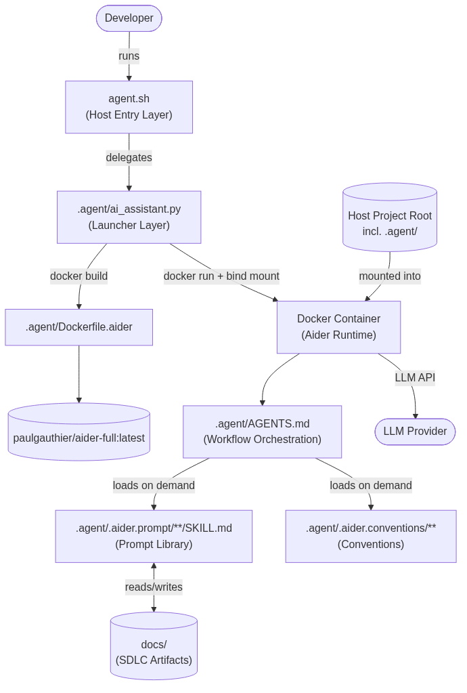

# Architecture Overview

AIAssistant is a developer CLI tool (script-launched, Dockerized, terminal-driven) built on a layered launcher + configuration-as-code architecture. A single host entry script (`agent.sh`) delegates to a Python launcher that manages the full Docker container lifecycle for an aider runtime. Inside the container, workflow orchestration is driven by markdown configuration (`AGENTS.md`) that loads SDLC prompt-library skills on demand, keeping the context window small and token usage minimal. All workflow state persists as git-tracked markdown artifacts under `docs/`.

## Core Layers

- **Host Entry Layer**: `agent.sh` — single-command entry point; delegates to the Python launcher (REQ-FR-ENV-2, REQ-FR-ENV-5).
- **Launcher Layer**: `.agent/ai_assistant.py` — Python (>=3.8, stdlib only); Docker availability check, image build, container run/cleanup, config argument assembly (REQ-FR-ENV-1).
- **Containerization Layer**: `.agent/Dockerfile.aider` + Docker — builds `paulgauthier/aider-full:latest`, mounts the host project root including `.agent/`, maps Docker GID for socket access (REQ-FR-ENV-4).
- **Workflow Orchestration Layer**: `.agent/AGENTS.md` — command routing, context-window management, conventions reference routing (REQ-FR-WF-2).
- **Prompt Library Layer**: `.agent/.aider.prompt/**/SKILL.md` — SDLC phase prompts and workflow chains (REQ-FR-WF-1, REQ-FR-TM-1, REQ-FR-TM-2).
- **Conventions Layer**: `.agent/.aider.conventions/**` — coding conventions loaded on demand by file-type routing (supports REQ-FR-WF-3).
- **Documentation Layer**: `docs/` — file-based SDLC artifacts produced and consumed by the workflow chain.
- **CI/CD Layer**: `.github/workflows/ci.yml` — GitHub Actions pipeline validating the launcher (Python lint), shell scripts (shellcheck), and Docker image build on push.

## Cross-cutting Concerns

- **Error Handling**: Launcher validates Docker availability and exits with clear errors; workflows enforce `[STOP]` gates and re-prompt on invalid input.
- **Logging**: Launcher command tracing and spinner updates; debug flag for verbose output.
- **Security**: Container isolation of the AI runtime; Docker socket GID mapping; prompts loaded via `/read-only` to prevent unintended edits.
- **State Synchronization**: File-based state; chain integrity requires each phase's output before the next phase.
- **Configuration**: `.agent/.aider.conf.yml`, `.agent/.aider.model.settings.yml`, `.agent/pyproject.toml`, `.agent/.aiderignore`.

## Integration Patterns

- **External Service Integration**: LLM API access via aider inside the container (API keys passed through the launcher).
- **Inter-service Communication**: Host → container via Docker CLI (bind mounts, environment variables, container naming/session hashing).
- **Event Handling**: User-driven command flow (`$`/`#` shorthand commands); no background or event-driven processing.
- **State Persistence**: Git-tracked markdown files in `docs/` as the single source of truth for workflow progress.

## Component Interactions

The developer runs `agent.sh`, which delegates to `.agent/ai_assistant.py`. The launcher verifies Docker availability, builds the image from `.agent/Dockerfile.aider`, and runs the container with the host project root bind-mounted. Inside the container, aider loads `.agent/AGENTS.md`, which loads `SKILL.md` files on demand via `/read-only`. Workflow phases read and write markdown artifacts in `docs/`.

## Interface Contracts

- `agent.sh` → `.agent/ai_assistant.py`: CLI arguments (debug flag, assistant arguments forwarded to aider).
- `.agent/ai_assistant.py` → Docker CLI: build/run/cleanup commands; container identity derived from workspace hash + session ID.
- Container → host project: read-write bind mount of the project root (including `.agent/`).
- `AGENTS.md` → `SKILL.md` files: `$<category>-<promptname>` shorthand mapped to `/read-only` and `/drop` context-management commands.
- Workflow chain → `docs/`: each phase consumes the previous phase's markdown artifact and produces the next.
