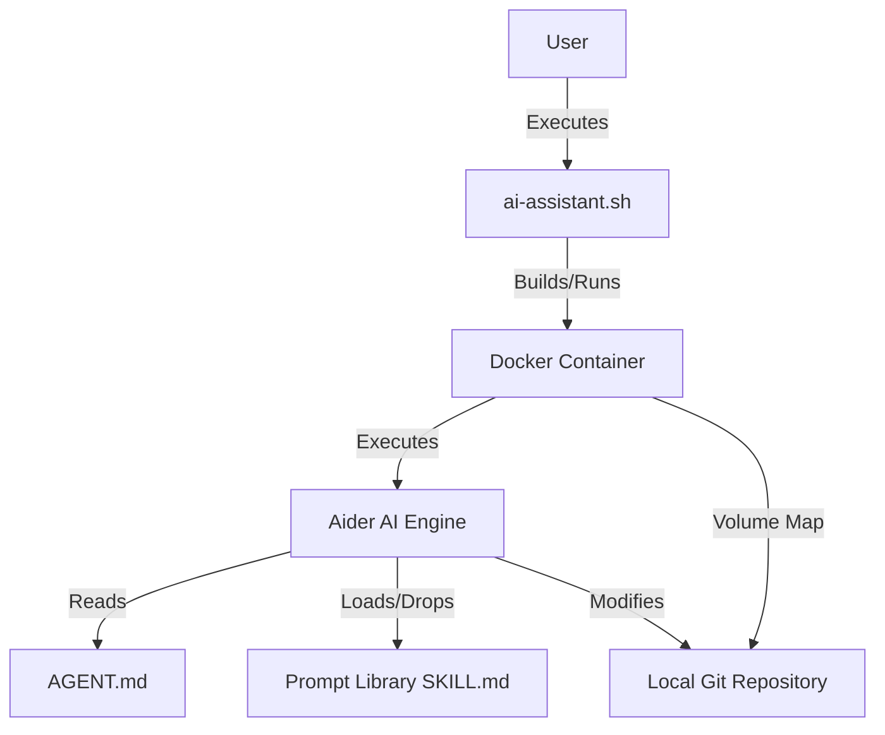

## Architecture Overview

Diagram Source

The system acts as a CLI wrapper and pipeline orchestrator for the Aider AI coding assistant. It leverages Bash scripting to manage a Dockerized environment, mapping local repositories into the container. Inside the container, Aider is orchestrated via an `AGENT.md` configuration file and a structured prompt library, enforcing a staged, context-isolated workflow to minimize token usage and adhere to SDLC best practices.

## Core Layers
- **Domain Layer**: Defines the core concepts of the prompt library, agent configuration, and task context. Interfaces ensure prompt loading and context management adhere to atomic execution rules.
- **Application Layer**: Contains the primary use cases such as launching the environment, orchestrating the workflow via Aider, and managing context. Services handle Docker lifecycle and prompt orchestration.
- **Infrastructure Layer**: Manages external integrations including the Docker Engine and Aider AI engine. Persistence is handled via the local filesystem, and communication relies on Bash and Docker CLI.
- **CLI Layer**: The entry point for the user, implemented as a Bash script (`ai-assistant.sh`) to provide a frictionless setup and launch experience.

## Cross-cutting Concerns
- **Error Handling**: Managed via Bash script exit codes and Docker container status checks to ensure environment stability.
- **Logging**: Relies on standard output and error streams from Aider and Docker for visibility.
- **Security**: Enforced through Docker volume mapping restrictions, ensuring local repository isolation.
- **State Synchronization**: Handled via `AGENT.md` context management commands (`/read-only`, `/drop`) to maintain optimal context windows.
- **Configuration**: Utilizes `.aider.conf.yml`, `.env`, and `Dockerfile.aider` for system and environment settings.

## Integration Patterns
- **External Service Integration**: Docker volume binds map local repositories directly into the containerized Aider environment.
- **Inter-service Communication**: The Bash script invokes Docker commands, which in turn execute Aider within the container.
- **Event Handling**: Aider shorthand commands (`$<category>-<promptname>`) trigger the loading or dropping of specific prompt files.
- **State Persistence**: Maintained through the local git repository and the file-based prompt library.

## Component Interactions
The user interacts with the CLI Layer (Bash script), which initializes the Infrastructure Layer (Docker container). Inside the container, the Application Layer (Aider) reads the Domain Layer (`AGENT.md` and prompt files) to execute the workflow. Data flows from user input through the Bash script to Docker, and into Aider, which processes the prompts and interacts with the mapped local repository.

## Interface Contracts
- **CLI Interface**: `ai-assistant.sh` accepts local repository paths and configuration flags.
- **Docker Interface**: `Dockerfile.aider` defines the container environment, and `docker-compose` manages volume mappings.
- **Prompt Interface**: `SKILL.md` files define the staged execution steps and context management rules for Aider.
